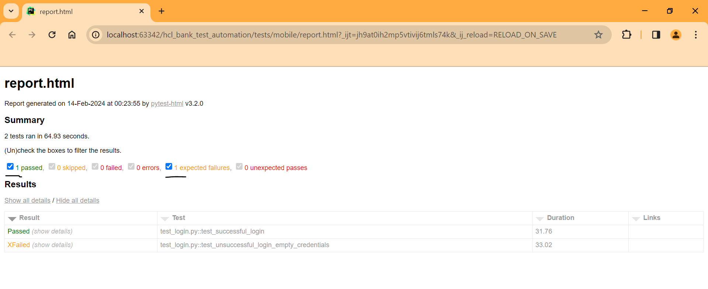

# Sample HCL Bank Test Automation

## Author

**Your Full Name**
- GitHub: https://github.com/orbo-tech/hcl_bank_test_automation

## About the Project

This project is a comprehensive pytest test automation suite for a sample HCL Bank, 
covering both mobile and API testing scenarios. 

Note: Mobiles tests are designed to run on cloud platforms like BrowserStack, 
providing flexibility and scalability for testing.

## Features

- **Mobile Testing:**
  - Automated tests for HCL Bank's mobile application using Appium on cloud platforms.
  - Utilizes Behavior-Driven Development (BDD) for clear scenario descriptions.
  - Generates HTML reports for detailed test results.

- **API Testing:**
  - Automated tests for sample API endpoints using pytest and REST Assured.
  - Generates HTML reports for detailed test results.

- **Common Fixtures:**
  - Utilizes a conftest file for shared fixtures.
  - Includes tear-down fixtures for cleanup after tests.

- **Run by Marker:**
  - Test cases can be selectively executed using pytest markers.
  - Markers include `@mobile`, `@api`, etc.

## Example Test Report

## Example Test Run GIF

## How to Run

### Local Execution:

1. **Setup:**
   - Install Python and pip.
   - Create a virtual environment: `python -m venv venv`.
   - Activate the virtual environment: `source venv/bin/activate` (Linux/macOS) or `venv\Scripts\activate` (Windows).
   - Install dependencies: `pip install -r requirements.txt`.

2. **Run Locally (Not Applicable):**
   - This project is designed to run on cloud platforms (BrowserStack), not locally on an Appium server.

### Cloud Execution:

1. **BrowserStack:**
   - Sign up for a BrowserStack account and obtain access credentials.
   - Configure the project with BrowserStack credentials in the conftest file.

2. **Run Tests:**
   - Execute tests by triggering a run on BrowserStack using the configured cloud settings.

### GitHub Workflow:

- The project is configured with GitHub Actions for continuous integration.
- Workflow files are available in the `.github/workflows` directory.

## Code Standards

- **PEP 8:**
  - The code follows the PEP 8 style guide for Python.

- **BDD:**
  - BDD scenarios are written using Gherkin syntax in the `features` directory.

- **HTML Reports:**
  - HTML reports are generated for both mobile and API test results.
  - Reports are available in the cloud testing platform dashboards.

- **Fixtures and Teardown:**
  - The `conftest.py` file contains shared fixtures and teardown methods.

- **Documentation:**
  - Code includes comments, docstrings, and a comprehensive `README.md` for clarity.

**Note: This project is specifically designed for cloud platforms like AWS Device Farm and BrowserStack and is not intended to run on a local Appium server.**
